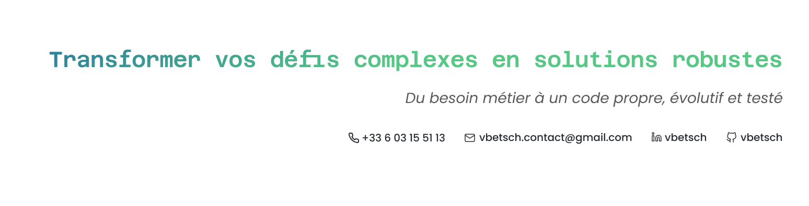

# Hello World, I'm Victor Betsch 👋

As a **Full-Stack Software Engineer**, years on the field have taught me one core conviction: untested code is future
technical debt. Passionate about Software Craftsmanship and TDD, I craft modern web ecosystems designed to scale and
built to last.

[LinkedIn](https://www.linkedin.com/in/vbetsch)
[Email](mailto:vbetsch.contact@gmail.com)
[Curriculum Vitae (FR)](https://vbetsch-production.s3-website.fr-par.scw.cloud/files/cv_fr.pdf)
[Portfolio (FR)](https://vbetsch-production.s3-website.fr-par.scw.cloud)

At my core, I am driven by a constant need to create and bring ideas to life. I bridge the gap between product and
engineering by crafting Figma mockups that translate product vision into developer-friendly interfaces before writing
code. To bring these interfaces to life efficiently, I actively participate in tech talks, continuously refining my
network and knowledge around modern web architectures and craftsmanship. This same quest for technical efficiency drives
me to use ArchLinux as my daily driver, leaning into custom configurations to optimize my overall development workflow.

### 🛠️ Core Tech Stack & Tooling

* **Core Ecosystem:** TypeScript, Java, Hono, Next.js, React, Angular, Astro
* **Quality & Craftsmanship:** TDD, Clean Architecture, Vitest, Jest, Playwright, ESLint, JUnit
* **Ops & Environment:** Docker, GitHub Actions, ArchLinux
* **Product & Design:** Figma, Responsive Design, UI/UX Prototyping

⬇️ Explore my featured repositories below to see how I apply these skills in practice. ⬇️

[📁 Explore all repositories](https://github.com/vbetsch?tab=repositories)
